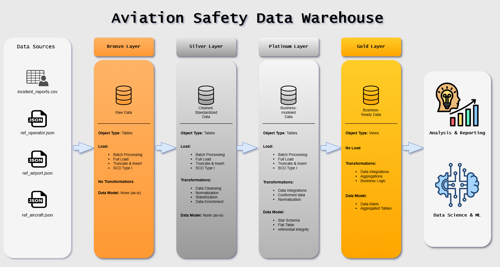
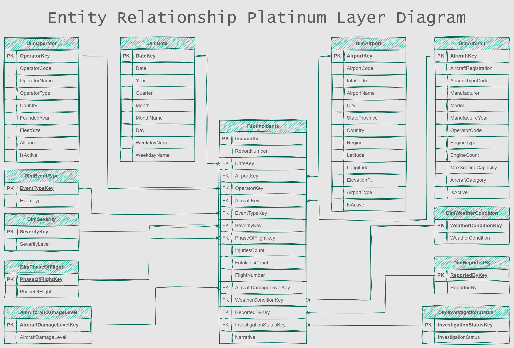

# Aviation Safety Data Warehouse

End-to-end ETL pipeline for an aviation safety data warehouse built on SQL Server. The solution uses layered modeling (Bronze → Silver → Gold → Platinum) with SQL-based transformations and Python-based orchestration, producing business-ready gold views for analysis.

---

## Overview

This project demonstrates the design and implementation of a modern data warehouse using SQL Server and Python. The warehouse ingests aviation incident data, applies data quality and transformation logic through multiple processing layers, and exposes curated analytical views for reporting and decision-making.

To simulate real-world data engineering challenges, the source data was generated using ChatGPT and intentionally infused with noise, inconsistencies, missing values, duplicates, and formatting issues. The ETL process includes cleansing, validation, logging, and quality checks to ensure data reliability throughout the pipeline.

---

## Architecture

The warehouse follows a layered architecture:

```text
Source Data
    │
    ▼
 Bronze Layer
    │
    ▼
 Silver Layer
    │
    ▼
 Gold Layer
    │
    ▼
 Platinum Layer
```

### Bronze Layer
- Raw ingestion of source files
- Minimal transformations
- Preservation of original data structure

### Silver Layer
- Data cleansing and standardization
- Deduplication
- Business rule enforcement
- Referential integrity preparation

### Gold Layer
- Dimensional modeling
- Fact and dimension tables
- Analytical data structures

### Platinum Layer
- Business-ready datasets
- Data quality validation
- Executive and reporting consumption layer

---

## Data Lineage

The following diagram illustrates the flow of data through the warehouse layers.



---

## Entity Relationship Diagram

The dimensional model used within the warehouse is shown below.



---

## Project Structure

```text
DW_PROJECT/
│
├── data/
│   ├── incident_reports.csv
│   ├── ref_aircraft.json
│   ├── ref_airport.json
│   └── ref_operator.json
│
├── docs/
│   ├── ER_diagram.png
│   └── warehouse.png
│
├── scripts/
│   ├── bronze/
│   ├── silver/
│   ├── gold/
│   ├── platinum/
│   ├── config/
│   ├── etl_logging/
│   └── tests/
│
├── etl_executor.py
├── requirements.txt
└── README.md
```

---

## Data Sources

The project uses a combination of:

- Aviation incident report data
- Aircraft reference data
- Airport reference data
- Operator reference data

Source datasets are intentionally designed with realistic quality issues to demonstrate ETL and data warehouse best practices.

---

## Data Quality Framework

Quality validation is implemented throughout the warehouse lifecycle.

### Bronze Checks
- Null value detection
- Duplicate record detection
- Source ingestion validation

### Silver Checks
- Data standardization validation
- Business rule verification
- Referential integrity checks

### Platinum Checks
- Dimension key uniqueness
- Fact-to-dimension relationship validation
- Analytical model consistency checks

Quality scripts are maintained under:

```text
scripts/tests/
├── bronze_quality_checks.sql
├── silver_quality_checks.sql
├── platinum_quality_checks.sql
└── pipeline_logging_checks.sql
```

---

## ETL Orchestration

Pipeline execution is orchestrated using Python.

Key responsibilities include:

- Layer execution sequencing
- Logging and monitoring
- Error handling
- Process control
- SQL script execution

Primary orchestration file:

```text
etl_executor.py
```

---

## Technologies Used

- SQL Server
- T-SQL
- Python
- Git
- GitHub
- Visual Studio Code

---

## Skills Demonstrated

- Data Warehousing
- ETL Development
- Dimensional Modeling
- SQL Server Development
- Data Quality Validation
- Data Pipeline Orchestration
- Git Version Control
- Database Design
- Data Modeling

---

## Future Enhancements

- Automated scheduling
- CI/CD deployment pipeline
- Additional data quality metrics
- Dashboard integration
- Incremental loading strategy
- Data catalog and metadata tracking

---

## Author

Demetrick Williams

Data Engineering Portfolio Project